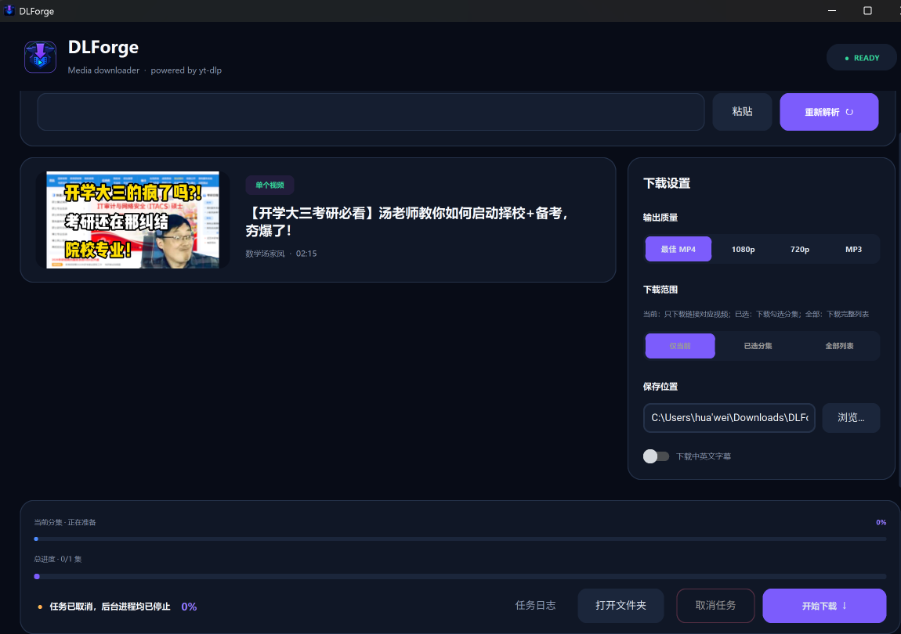
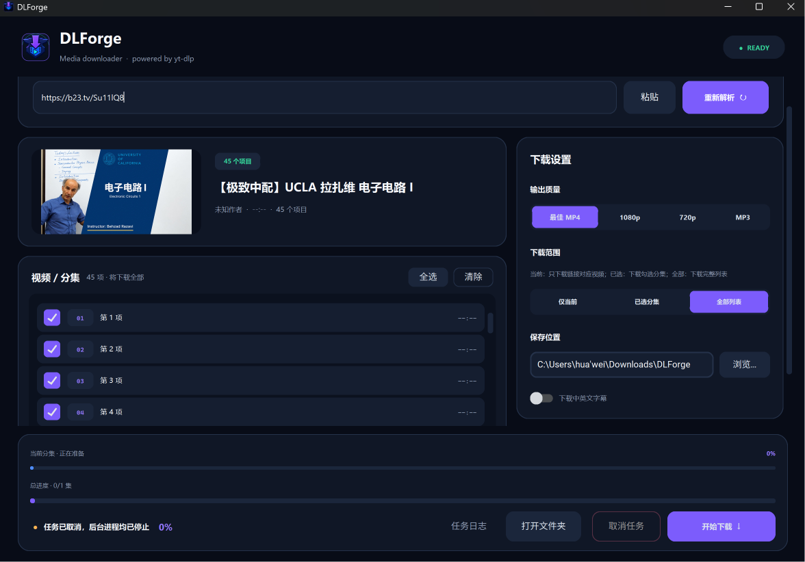

<p align="center">
  
</p>

<h1 align="center">DLForge</h1>

<p align="center">
  <strong>A modern Windows GUI for yt-dlp & FFmpeg</strong><br>
  Download videos from YouTube, Bilibili, and 1,900+ sites — playlist support, subtitles, dark UI
</p>

<p align="center">
  <a href="https://github.com/0higgs/DLForge/releases"></a>
  <a href="LICENSE"></a>
  <a href="#"></a>
  <a href="#"></a>
</p>

<br>

<p align="center">
  
</p>

<p align="center">
  
</p>

---

## Why DLForge?

Most yt-dlp GUIs are web wrappers or Electron apps. DLForge is a **native Windows app** built with CustomTkinter — lightweight, no browser engine, and the target PC needs **zero pre-installed dependencies** (no Python, no yt-dlp, no FFmpeg).

| | Other GUIs | DLForge |
|---|---|---|
| 💾 Install size | 150 MB+ (Electron) | ~80 MB |
| 🐍 Requires Python? | Often yes | **No** — self-contained |
| 🌙 Dark mode | Usually CSS | **Native Windows dark theme** |
| 📋 Playlist UX | Single-flat list | **Per-episode selection + retry** |
| 🎬 Bilibili | Generic titles | **BV API → accurate episode names** |
| 📦 Offline installer | Rare | **Yes (Inno Setup)** |

---

## Features

- 🔗 **Paste & parse** — single videos, playlists, multi-video collections
- ✅ **Per-episode selection** — download one, selected, or all episodes
- 🎬 **Bilibili enhancement** — accurate episode titles via B站 API
- 📺 **Quality presets** — Best MP4, 1080p, 720p, MP3 audio
- 🇨🇳🇬🇧 **Subtitle download** — zh-Hans, zh-Hant, English (auto + manual)
- 📊 **Dual progress bars** — per-episode + overall task progress
- 🔄 **Retry failed episodes** — partial failures auto-select failed items
- 📝 **Real-time log** — scrollable yt-dlp output viewer
- ⚡ **Process tree cancel** — `taskkill /T /F` kills yt-dlp + FFmpeg cleanly
- 📂 **One-click output** — open download folder instantly
- 🎨 **Dark card UI** — #080C17 palette, 18px rounded cards, smooth animations

---

## Quick Start

### Option 1: Offline Installer (Recommended)

Download `DLForge-*-Setup-offline.exe` from [Releases](https://github.com/0higgs/DLForge/releases) and run it. Everything is self-contained — no internet needed during install.

### Option 2: Portable ZIP

Download `DLForge-*-win64.zip` from [Releases](https://github.com/0higgs/DLForge/releases), extract, and run `DLForge\DLForge.exe`.

> ⚠️ Do NOT run the EXE directly from PyInstaller's `build` directory. Always use the `dist\DLForge\` folder.

### Option 3: Run from Source

```powershell
# 1. Install dependencies
python -m pip install -r requirements.txt

# 2. Download yt-dlp, ffmpeg, ffprobe
powershell -ExecutionPolicy Bypass -File .\scripts\prepare_tools.ps1

# 3. Launch
python .\app.py
```

Requires Python 3.12+ and Windows 10+.

---

## Build

```powershell
# Build the PyInstaller package → dist\DLForge\DLForge.exe
powershell -ExecutionPolicy Bypass -File .\scripts\build.ps1

# Create ZIP release + SHA-256
powershell -ExecutionPolicy Bypass -File .\scripts\package.ps1

# Build offline Inno Setup installer (requires Inno Setup 6.7+)
powershell -ExecutionPolicy Bypass -File .\scripts\build_installer.ps1
```

Run `python app.py --self-test` to verify that yt-dlp, ffmpeg, and ffprobe are functional in the packaged build.

---

## Architecture

```
┌──────────────┐     ┌────────────────┐     ┌─────────────────┐
│  dlforge/app │────▶│ queue.Queue()  │────▶│  dlforge/engine │
│  (GUI/CTk)   │◀────│  80ms poll     │◀────│  (yt-dlp proc)  │
└──────────────┘     └────────────────┘     └─────────────────┘
                                                  │
                    DLFORGE_PROGRESS:             │
                    DLFORGE_FILE:     ◀───────────┘
```

Three layers in the `dlforge/` package:
- **`engine.py`** — Download engine: spawns yt-dlp, parses stdout, emits events
- **`app.py`** — GUI: CustomTkinter dark card UI, event-driven via `queue.Queue`
- **`__init__.py`** — Version number `__version__`

All tools (yt-dlp, ffmpeg, ffprobe) are pinned with SHA-256 verification and never use the system PATH in frozen mode.

---

## FAQ

### Is it free?
Yes. DLForge is MIT-licensed. Third-party components (FFmpeg, yt-dlp) retain their own licenses — see [THIRD_PARTY_NOTICES.txt](THIRD_PARTY_NOTICES.txt).

### Does it work on Mac / Linux?
Not yet. The GUI uses Windows-specific Tcl/Tk packaging. A cross-platform version would need a different UI framework (see the Android port at `D:\Android\DLForge`).

### Where are the binaries?
This repo only contains source code, tests, and build scripts. Pre-built releases (with yt-dlp + FFmpeg) are on the [Releases](https://github.com/0higgs/DLForge/releases) page. Run `scripts/prepare_tools.ps1` to download the pinned tool versions for local development.

### Is it legal?
DLForge itself is a download tool. Only download content you have the right to save, and comply with the target site's terms of service and local laws.

---

## Star History

If you find DLForge useful, a ⭐ helps others discover it!

[](https://star-history.com/#0higgs/DLForge&Date)

---

<p align="center">
  <sub>中文用户请阅读 <a href="README_CN.md">README_CN.md</a></sub>
</p>
